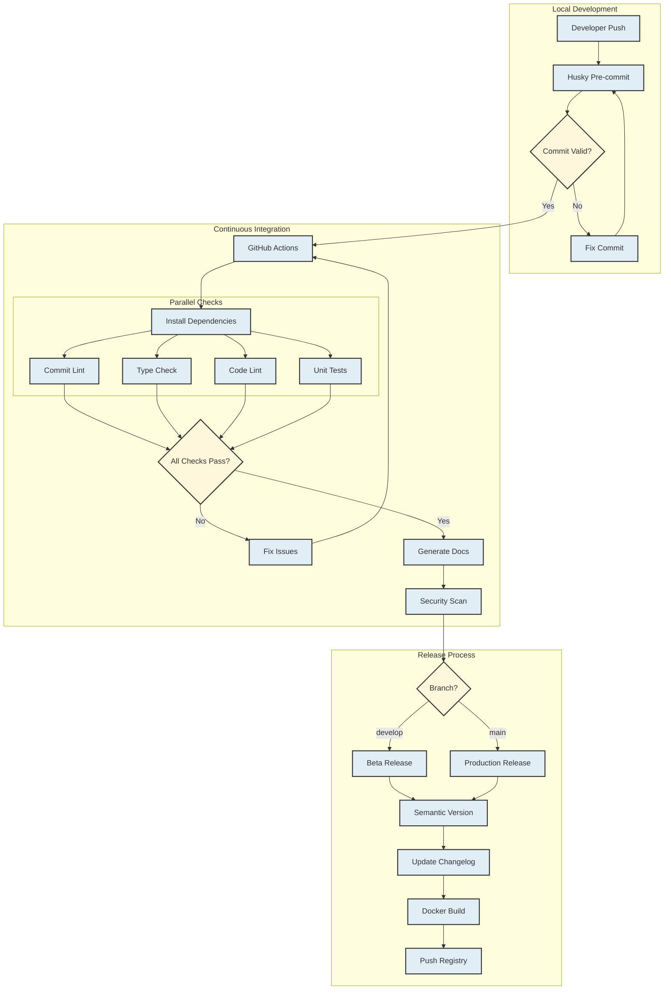

# CI/CD Pipeline Documentation

## Pipeline Overview

This project's CI/CD pipeline implements a robust automation process for code integration, testing, and deployment. Below is a visual representation of the pipeline:



## Pipeline Stages

### 1. Local Development Phase
All changes begin with local development, where:
- Developers create feature branches from `develop`
- Husky pre-commit hooks verify:
  - Commit message format
  - Code linting
  - Type checking
- Failed checks must be fixed before commit

```bash
# These checks run automatically via husky
git commit -m "feat(auth): implement JWT authentication"
```

### 2. Continuous Integration

#### Commit Validation
- Ensures commit messages follow the conventional commit format
- Validates branch naming conventions
- Checks PR title format

#### Code Quality
- Static type checking: `npm run build:compile`
- Linting with Google TypeScript Style (GTS): `npm run lint:check`
- Unit tests: `npm run test`
- Code coverage analysis: `npm run test:coverage`
  - Minimum coverage threshold: 80%

#### Documentation
- TypeDoc generation: `npm run docs:typedoc`
- OpenAPI documentation: `npm run docs:openapi`

#### Security Checks
- npm audit for dependency vulnerabilities
- Snyk security scanning
- Docker image vulnerability scanning

### 3. Release Process

The release process is automated using semantic-release and follows semantic versioning:

#### Branch-specific Behavior

**Main Branch:**
- Creates production releases
- Generates release notes
- Updates CHANGELOG.md
- Creates Git tags
- Builds and pushes Docker images with version tags

**Develop Branch:**
- Creates beta releases
- Adds beta tag to versions
- Updates pre-release documentation
- Builds and pushes Docker images with beta tags

```bash
# Release Commands
npm run release:prod  # Production release
npm run release:dev   # Development release
```

#### Version Bumps
Version numbers are automatically incremented based on commit types:
- `fix:` → Patch release (1.0.0 → 1.0.1)
- `feat:` → Minor release (1.0.0 → 1.1.0)
- `feat!:` or `fix!:` → Major release (1.0.0 → 2.0.0)

## Workflow Examples

### Feature Development
```bash
# Create feature branch
git checkout -b feat/new-feature develop

# Make changes and commit
git commit -m "feat(scope): add new feature"

# Push changes
git push origin feat/new-feature

# Create PR to develop
# CI pipeline runs automatically
```

### Hotfix Process
```bash
# Create hotfix branch
git checkout -b hotfix/issue-fix main

# Fix issue and commit
git commit -m "fix(scope): resolve critical issue"

# Push changes
git push origin hotfix/issue-fix

# Create PR to main
# CI pipeline runs with priority
```

## Pipeline Status Badges

[](https://github.com/{owner}/{repo}/actions/workflows/ci.yml)
[](https://github.com/{owner}/{repo}/actions/workflows/release.yml)
[](https://github.com/{owner}/{repo}/actions/workflows/security.yml)

## Environment Setup

### Required Secrets
Set up the following secrets in your GitHub repository:
- `SNYK_TOKEN`: For security scanning
- `GITHUB_TOKEN`: Automatically provided by GitHub Actions

### Required Dependencies
Ensure these tools are installed locally:
```json
{
  "devDependencies": {
    "@commitlint/cli": "^19.5.0",
    "@commitlint/config-conventional": "^19.5.0",
    "husky": "^9.1.6",
    "semantic-release": "^24.0.0"
  }
}
```

## Troubleshooting

### Common Issues

1. **Failed Commit Validation**
   ```bash
   # Correct format
   type(scope): description
   
   # Example
   feat(auth): implement OAuth2 flow
   ```

2. **Failed Tests**
   - Run tests locally: `npm test`
   - Check coverage: `npm run test:coverage`

3. **Failed Builds**
   - Clean build artifacts: `npm run build:clean`
   - Rebuild: `npm run build:compile`

### Pipeline Monitoring

Monitor pipeline status:
1. GitHub Actions dashboard
2. Release logs in GitHub Releases
3. Docker image registry
4. Documentation artifacts

## Best Practices

1. **Commits**
   - Use conventional commit format
   - Include scope when applicable
   - Reference issues in commit body

2. **Pull Requests**
   - Follow PR template
   - Include tests
   - Update documentation
   - Link related issues

3. **Code Quality**
   - Maintain test coverage
   - Address all linting issues
   - Document public APIs

4. **Security**
   - Review dependency updates
   - Address security alerts promptly
   - Keep Docker base images updated

## Contacts

- **CI/CD Issues**: Open an issue with label `ci-cd`
- **Security Concerns**: Open an issue with label `security`
- **Documentation Updates**: Open an issue with label `documentation`
