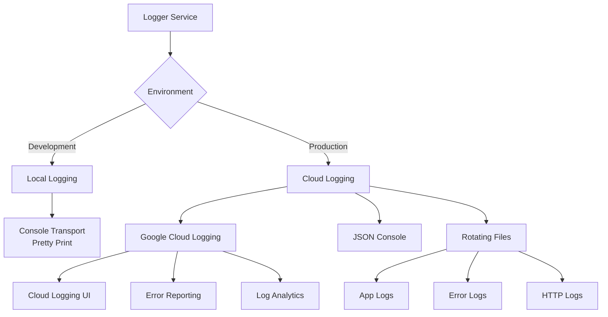

# Logging System

## Overview

The logging system implements a structured, environment-aware logging solution using Winston with Google Cloud Logging integration. The system provides detailed debugging information in development while maintaining high-performance, machine-readable logs in production environments.



## Dependencies

```json
{
  "dependencies": {
    "winston": "^3.11.0",
    "winston-daily-rotate-file": "^5.0.0",
    "@google-cloud/logging-winston": "^6.0.0"
  }
}
```

## Configuration

### Environment Variables
```env
# Local Development
NODE_ENV=development
LOG_LEVEL=debug
SERVICE_NAME=ts-microservice

# Production
NODE_ENV=production
GOOGLE_CLOUD_PROJECT=your-project-id
SERVICE_NAME=ts-microservice
VERSION=1.0.0
CLOUD_RUN_LOCATION=us-central1
```

### Docker Configuration
```yaml
version: '3.8'
services:
  app:
    environment:
      - NODE_ENV=production
      - GOOGLE_CLOUD_PROJECT=your-project-id
      - SERVICE_NAME=ts-microservice
    volumes:
      - ./logs:/var/log
      # If using service account key
      - ./service-account.json:/app/service-account.json
```

## Usage Examples

### Basic Logging
```typescript
@injectable()
class CustomerService {
  constructor(@inject(LoggerService) private logger: LoggerService) {}

  async createCustomer(data: CustomerDTO): Promise<Customer> {
    this.logger.info('Creating customer', {
      customerId: data.id,
      email: data.email,
    });

    try {
      const customer = await this.customerRepository.create(data);
      
      this.logger.debug('Customer created successfully', {
        customerId: customer.id
      });
      
      return customer;
    } catch (error) {
      this.logger.error('Failed to create customer', error as Error, {
        customerId: data.id
      });
      throw error;
    }
  }
}
```

### HTTP Request Logging
```typescript
@injectable()
class RequestLoggerMiddleware {
  constructor(@inject(LoggerService) private logger: LoggerService) {}

  handle(req: Request, res: Response, next: NextFunction): void {
    const requestId = randomUUID();
    
    this.logger.http('Incoming request', {
      requestId,
      method: req.method,
      url: req.url,
      userAgent: req.get('user-agent'),
    });
  }
}
```

## Log Output Examples

### Development Mode (Console)
```bash
2024-10-30 12:34:56.789 [INFO]: Creating customer [RequestId: 550e8400-e29b-41d4-a716-446655440000]
  customerId: "123"
  email: "customer@example.com"
```

### Production Mode (Google Cloud Logging)
```json
{
  "severity": "INFO",
  "message": "Creating customer",
  "timestamp": "2024-10-30T12:34:56.789Z",
  "requestId": "550e8400-e29b-41d4-a716-446655440000",
  "customerId": "123",
  "email": "customer@example.com",
  "service": "ts-microservice",
  "serviceContext": {
    "service": "ts-microservice",
    "version": "1.0.0"
  },
  "resource": {
    "type": "cloud_run_revision",
    "labels": {
      "service_name": "ts-microservice",
      "revision_name": "v1",
      "location": "us-central1"
    }
  }
}
```

## Log Levels

| Level | Local Development | Google Cloud Severity | Usage |
|-------|------------------|----------------------|--------|
| `error` | Red Console | ERROR | Application errors requiring attention |
| `warn` | Yellow Console | WARNING | Concerning but non-critical issues |
| `info` | Green Console | INFO | Normal application flow events |
| `http` | Blue Console | DEFAULT | HTTP request/response logs |
| `debug` | Gray Console | DEBUG | Detailed debugging information |

## Security and Data Protection

### Automatic Data Redaction
```typescript
const sensitiveFields = [
  'password',
  'secret',
  'token',
  'authorization',
  'credentials'
];

// Example
logger.info('User login', {
  email: 'user@example.com',
  password: 'secret123'  // Will be logged as '[REDACTED]'
});
```

### Request Data Handling
```typescript
// Headers redaction
const safeHeaders = {
  ...headers,
  authorization: '[REDACTED]',
  cookie: '[REDACTED]'
};

// Body sanitization
const safeBody = this.sanitizeBody(req.body);
```

## Google Cloud Integration

### Service Context
```typescript
const googleLogging = new LoggingWinston({
  projectId,
  logName: 'ts-microservice',
  serviceContext: {
    service: process.env.SERVICE_NAME,
    version: process.env.VERSION,
  },
  resource: {
    type: 'cloud_run_revision',
    labels: {
      service_name: process.env.SERVICE_NAME,
      revision_name: process.env.K_REVISION,
      location: process.env.CLOUD_RUN_LOCATION,
    }
  }
});
```

### Error Reporting
```typescript
// Error logs automatically include:
// - Stack trace
// - Source location
// - Error cause chain
logger.error('Operation failed', error as Error, {
  'logging.googleapis.com/sourceLocation': {
    file: 'customer.service.ts',
    line: '42',
    function: 'createCustomer'
  }
});
```

## Performance Considerations

### Log Sampling
```typescript
// Production configuration
const shouldLog = Math.random() < 0.1; // 10% sampling
if (shouldLog) {
  logger.debug('Detailed operation info', context);
}
```

### Async Logging
Google Cloud Logging is asynchronous by default, preventing blocking operations.

## Monitoring Integration

### Metrics Export
```typescript
// Automatically exports to Cloud Monitoring:
- Request latency
- Error rates
- Log entry counts
- Resource utilization
```

### Log-based Metrics
```typescript
// Custom metrics in Google Cloud
resource.type="cloud_run_revision"
severity="ERROR"
json_payload.customerId="123"
```

## Troubleshooting

### Common Issues

1. **Missing Google Cloud Logs**
   ```bash
   # Check credentials
   echo $GOOGLE_APPLICATION_CREDENTIALS
   
   # Verify project ID
   echo $GOOGLE_CLOUD_PROJECT
   ```

2. **Performance Issues**
   ```typescript
   // Enable sampling for high-traffic routes
   if (this.shouldSample()) {
     this.logger.debug('Detailed debug info');
   }
   ```

3. **Local Development**
   ```bash
   # Enable debug logging
   export LOG_LEVEL=debug
   
   # View local logs
   tail -f logs/development/app-2024-10-30.log
   ```

## Best Practices

1. **Structured Logging**
   ```typescript
   // Good
   logger.info('Order processed', {
     orderId,
     amount,
     currency
   });

   // Bad
   logger.info(`Order ${orderId} processed for ${amount} ${currency}`);
   ```

2. **Error Handling**
   ```typescript
   try {
     await processOrder(orderId);
   } catch (error) {
     logger.error('Order processing failed', error as Error, {
       orderId,
       customerId
     });
   }
   ```

3. **Context Propagation**
   ```typescript
   // Always include request context
   const context = {
     requestId,
     correlationId,
     userId
   };
   ```
