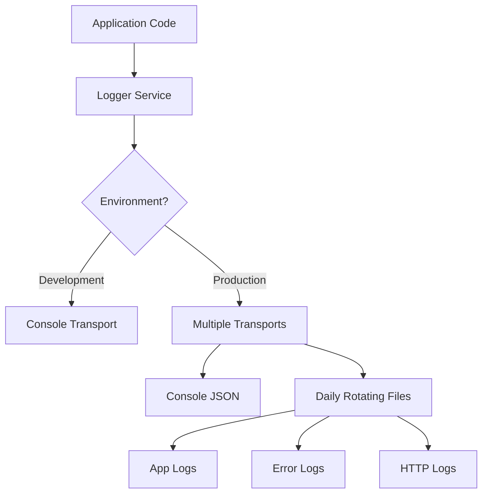

# Logging Strategy

## Overview

Our logging strategy implements a structured, environment-aware logging system using Winston. The system is designed to provide detailed debugging information during development while maintaining high-performance, machine-readable logs in production.



## Features

- ✅ Structured JSON logging in production
- ✅ Pretty-printed, colored logs in development
- ✅ Automatic log rotation and retention
- ✅ Request ID tracking across services
- ✅ Performance metrics for HTTP requests
- ✅ Sensitive data redaction
- ✅ Stack trace preservation
- ✅ Multiple severity levels

## Log Levels

| Level | Usage |
|-------|-------|
| `error` | Application errors that need attention |
| `warn` | Concerning but non-critical issues |
| `info` | Normal application flow events |
| `http` | HTTP request/response logs |
| `debug` | Detailed debugging information |

## Environment-Specific Configuration

### Development
```typescript
{
  level: 'debug',
  format: 'pretty',
  rotation: {
    maxSize: '10m',
    maxFiles: '7d'
  }
}
```

### Production
```typescript
{
  level: 'info',
  format: 'json',
  rotation: {
    maxSize: '20m',
    maxFiles: '14d'
  }
}
```

## Usage Examples

### Basic Logging
```typescript
// Inject the logger into your service
@injectable()
class UserService {
  constructor(@inject(LoggerService) private logger: LoggerService) {}

  async createUser(userData: UserDTO): Promise<User> {
    // Info level for normal operations
    this.logger.info('Creating new user', {
      userId: userData.id,
      email: userData.email
    });

    try {
      const user = await this.userRepository.create(userData);
      
      // Debug level for detailed information
      this.logger.debug('User created successfully', {
        userId: user.id
      });
      
      return user;
    } catch (error) {
      // Error level for failures
      this.logger.error('Failed to create user', error, {
        userData
      });
      throw error;
    }
  }
}
```

### Request Logging
```typescript
// Automatically logs HTTP requests and responses
app.use(requestLoggerMiddleware.handle.bind(requestLoggerMiddleware));
```

## Log Output Examples

### Development Console
```
2024-10-30 12:34:56.789 [INFO]: Creating new user [RequestId: 550e8400-e29b-41d4-a716-446655440000]
2024-10-30 12:34:56.880 [DEBUG]: User created successfully [RequestId: 550e8400-e29b-41d4-a716-446655440000]
```

### Production JSON
```json
{
  "level": "info",
  "message": "Creating new user",
  "timestamp": "2024-10-30T12:34:56.789Z",
  "requestId": "550e8400-e29b-41d4-a716-446655440000",
  "userId": "123",
  "service": "ts-microservice",
  "environment": "production"
}
```

## Configuration

### Environment Variables
```bash
# .env
LOG_LEVEL=info                  # Logging level (error, warn, info, http, debug)
SERVICE_NAME=ts-microservice    # Service name for log identification
NODE_ENV=production            # Environment (development, test, production)
```

### Docker Setup
```yaml
# docker-compose.yml
version: '3.8'
services:
  app:
    volumes:
      - ./logs:/var/log
    environment:
      - NODE_ENV=production
      - LOG_LEVEL=info
      - SERVICE_NAME=ts-microservice
```

## Security Considerations

### Sensitive Data Redaction
The following fields are automatically redacted:
- `password`
- `secret`
- `token`
- `authorization`

Example:
```typescript
logger.info('User login', { 
  email: 'user@example.com',
  password: '12345' // Will be logged as '[REDACTED]'
});
```

## Log File Management

### Rotation Policy
- Files are rotated daily
- Production logs are kept for 14 days
- Development logs are kept for 7 days
- Maximum file size: 20MB (production), 10MB (development)

### Log File Structure
```
/var/log/
├── app-2024-10-30.log        # Application logs
├── error-2024-10-30.log      # Error-level logs
└── exceptions-2024-10-30.log # Uncaught exceptions
```

## Best Practices

1. **Use Appropriate Log Levels**
   - `error`: For errors that need immediate attention
   - `warn`: For concerning but non-critical issues
   - `info`: For important business events
   - `http`: For API requests and responses
   - `debug`: For detailed debugging information

2. **Include Context**
   ```typescript
   // Good
   logger.info('Order processed', { 
     orderId: '123',
     userId: '456',
     amount: 99.99
   });

   // Bad
   logger.info('Order 123 processed');
   ```

3. **Error Logging**
   ```typescript
   try {
     await processOrder(orderId);
   } catch (error) {
     logger.error('Order processing failed', error, {
       orderId,
       userId
     });
   }
   ```

4. **HTTP Context**
   - Always include `requestId` for tracing
   - Log request duration
   - Include relevant headers
   - Redact sensitive information

## Monitoring Integration

Logs are formatted to be easily integrated with:
- ELK Stack
- Datadog
- Prometheus/Grafana
- CloudWatch

## Performance Considerations

- JSON logging in production for efficient parsing
- Asynchronous file writing
- Log rotation to prevent disk space issues
- Sampling for high-volume endpoints
